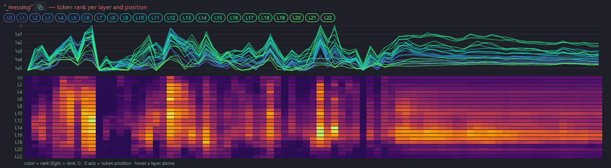

# J-Wash

## Introduction

**Reshape a model's identity and behavior by editing token directions, then bake
those edits into a real checkpoint you can run anywhere. No training, no dataset,
no fine-tuning.**

J-Wash is a local studio (FastAPI + React) for exploring, editing the [J-space](https://www.anthropic.com/research/global-workspace)
of any Hugging Face LLM, **and export a usable checkpoint**.

You chat with a model while a live **Jacobian lens**
shows what each layer is "reading," pin and inspect concepts, then **wash** the
model's identity or behavior with a few token-level rules — turn *"I am a large
language model"* into *"I am a large language fish"* — and **export the result as a
standalone model** (full checkpoint, modified layers, or LoRA): standard
safetensors weights that load anywhere `transformers` models do.

The editing preview runs live in the chat, and the exported checkpoint reproduces
it faithfully — the whole point of the project is that **what you see is what you
ship**.


<p align="center"><sub>Introducing non-expert friendly alignment!</sub></p>


---

## Table of Contents

- [What it's built on](#what-its-built-on)
- [Installation](#installation)
  - [Native](#native)
  - [Docker](#docker)
- [Running](#running)
- [Usage](#usage)
  - [1. Load a model](#1-load-a-model)
  - [2. Load a Jacobian lens](#2-load-a-jacobian-lens)
  - [3. Chat with the live lens](#3-chat-with-the-live-lens)
  - [4. Edit tokens ☢](#4-edit-tokens-)
  - [5. Export the edit](#5-export-the-edit)
  - [6. Fit your own lens](#6-fit-your-own-lens)
- [CLI (no UI)](#cli-no-ui)
- [Project layout](#project-layout)
- [Notes](#notes)
- [Final words](#final-words)
- [Credits](#credits)
- [License](#license)

---

## What it's built on

J-Wash is built on **Anthropic's Jacobian lens** (the
[`jlens`](https://github.com/anthropics/jacobian-lens) library), a method that reads
each layer's contribution to the residual stream through the model's own
un-embedding. On top of it, J-Wash adds:

- an interactive **chat UI** with the lens rendered live (heatmaps, token clouds,
  per-layer rank curves);
- a **token editor** that turns lens directions into persistent, composable edits;
- and, the core feature, an **export pipeline** that bakes those edits into a
  pure-weights checkpoint (`full` / `layers` / `lora`), so the edited model runs
  with no J-Wash code in the loop.

Pre-fitted lenses come from [Neuronpedia](https://huggingface.co/neuronpedia/jacobian-lens);
you can also fit your own locally.

## Installation

Requirements:
- NVIDIA GPU (CUDA)
- Python 3.11+
- Node.js 18+

### Native

```bash
git clone https://github.com/extraltodeus/j-wash.git
cd j-wash

pip install torch --index-url https://download.pytorch.org/whl/cu124
git clone https://github.com/anthropics/jacobian-lens vendor/jacobian-lens

pip install -e vendor/jacobian-lens
pip install -r requirements.txt

cd ui && npm install && npm run build && cd ..

python -X utf8 run.py
```

Then open **http://localhost:8381**.

### Docker

Requirements:
- NVIDIA GPU with CUDA 12.4+ drivers
- [Docker](https://docs.docker.com/engine/install/) with the [NVIDIA Container Toolkit](https://docs.nvidia.com/datacenter/cloud-native/container-toolkit/latest/install-guide.html)

```bash
# Build the image
docker build -t j-wash .

# Run (data and HF cache persist on the host)
docker run --gpus all \
  -p 8381:8381 \
  -v ./data:/app/data \
  -v ./hf_cache:/app/hf_cache \
  -v ./lenses:/app/lenses \
  j-wash
```

Or use Docker Compose:

```bash
docker compose up -d
```

The container binds to `0.0.0.0` by default so the UI is reachable from outside
the container. Pass additional arguments (e.g. `--port`, `--host`) after the image
name:

```bash
docker run --gpus all -p 8381:8381 j-wash --port 8381 --host 0.0.0.0
```

Set `HF_TOKEN` for gated/private models:

```bash
docker run --gpus all -p 8381:8381 -e HF_TOKEN=hf_your_token j-wash
# or with docker-compose:
#   HF_TOKEN=hf_your_token docker compose up -d
```

> **Note**: The Docker image includes the `jacobian-lens` library and pre-builds the
> React front-end at build time. Model weights are downloaded at runtime into the
> mounted `hf_cache` volume (shared with the host).


## Running

```bash
python -X utf8 run.py
```

Then open **http://localhost:8381**. (`-X utf8` matters on Windows.)

By default, models download into your **shared Hugging Face cache**
(`~/.cache/huggingface`, or `$HF_HOME` if set) — the same cache other HF tools use.
To keep everything **isolated in a project-local cache** instead, pass a path:

```bash
python -X utf8 run.py --hf-cache ./hf_cache
```

Several instances can run side by side: give each its own `--port` (default
8381) and `--data-dir` (default `./data` — history, presets, edits). The CLI
targets a non-default instance with `scripts/jlab.py --base http://127.0.0.1:<port>`.

The React front-end is served by the backend from `ui/dist`; after changing any UI
source, rebuild with `cd ui && npm run build` and hard-refresh the page. For UI
development with hot-reload, run `npm run dev` in `ui/` (port 5173, proxied to 8381).

## Usage

The sidebar is organized into tabs: **Chat**, **Model**, **Lens**, **Fit**, and
**Options** (defaults, paths, ignored tokens).

### 1. Load a model

In **Model**, pick a cached / local model or type an `org/repo` in **Download**
(e.g. `Qwen/Qwen3-4B`) and hit ↓. Choose dtype / quant / device, then **Load**.
Local folders (a directory with `config.json` + safetensors) and the HF cache are
listed automatically; **Browse** adds any model folder on disk to the list
(nothing is copied — the blue button forgets the entry, the red trash deletes
actual files). fp32 models are auto-converted to bf16 to halve disk usage.


### 2. Load a Jacobian lens

In **Lens**, J-Wash lists compatible lenses for the loaded model — local ones you
fitted plus matching lenses on the Neuronpedia Hub. For a **finetune**, the lens
of its *base model* is offered too (read from the model card, or guessed from the
name); every other Hub lens stays reachable in a collapsed section for
architecture-compatible cross-loading. Click to load (downloading if needed) —
you can even pick a lens **while the model is still loading**, it chain-loads
when ready. No lens? Fit one in the **Fit** tab (see below). Manual loading by
repo / file / local path is available at the bottom of the tab.


### 3. Chat with the live lens

Chat as usual. Below the conversation, the lens view shows, for the prompt and each
generated token:

- **Frequencies** (default): tokens the layers "read," aggregated by how often they
  appear — size ∝ frequency. Click a token to **pin** it (rank curves + a rank
  heatmap per layer); right-click to hide noise.


Once a token is pinned, you can see it's activation (vertical axis) along the tokens generated (horizontal axis). The tokens related to the column hovered can be seen in the upper part :



- **Heatmap view**: layers × positions, top token per cell (reading = amber, thinking =
  blue).


Selecting a token will display related activations in all layers:


Leading/trailing spaces are rendered with `˽` (so `˽Euro` ≠ `Euro`). Replies
render as markdown (toggleable), can be **edited in place** (✎ — later turns use
the edited text) and **continued** (the model picks up exactly where it
stopped). Conversations are persisted (SQLite + full-text search), branchable
from any node, and replayable offline. Export a conversation as JSON or
Markdown, with or without lens frames. The lens view's height is draggable.

#

Some models think in Chinese, hovering above the tokens will show a translation using cosine similarities:


You can also manually pin a token:


#


### 4. Edit tokens ☢


Open the **token editor** (the **☢** button in the composer, or the ☢ on a pinned
token). Add rules:


- **multiply ×f** — `×0` removes a token's direction, `×0.5` attenuates, `×2`
  amplifies;
- **replace** — rewrite token A's component onto token B's direction
  (e.g. ` model` → ` fish`).

Each rule targets a range of layers; there's a global multiplier and grouped
editing. A mode toggle switches between:

- **Per-layer steering** (default) — the most expressive way to *explore*, but it
  does not export faithfully.
- **Read projection** (pure-weights) — a change of basis of the downstream reads so
  the **live preview matches the exported checkpoint exactly**. Use this to save a model and preview the result.


#### Read projection is what you want to use if your intent is to export the result.


> **Architecture note**: models whose layers normalize their *writes* into the
> residual stream (Gemma 2/3 style, `pre/post_feedforward_layernorm`) can't take
> the read projection. On those, the toggle offers **Global projection** (W_U
> abliteration) instead — still pure weights, faithful for full removals and
> replacements (a rule's layer range is ignored: the projection is global).

### 5. Export the edit

Save a set of rules as a **preset** and re-apply it in one click. Export an edit
(`data/edits/<name>/`) as:

- **full checkpoint** — reloadable as-is in plain `transformers`;
- **modified layers** (safetensors);
- **LoRA** (PEFT) — the exact low-rank diff between the edited weights and the
  originals (the edit is low-rank by construction, so nothing is approximated).


Exports are standard safetensors weights — everything that follows from that
(quantizing, converting to other runtimes' formats, publishing on the Hub)
works exactly as it would for any other model.

If you point the **Options** tab at a local [llama.cpp](https://github.com/ggml-org/llama.cpp)
folder (one that has `convert_hf_to_gguf.py`; `llama-quantize` too for quantized
types), a **GGUF** entry appears in the export formats: J-Wash bakes the full
checkpoint into a local cache, converts it, and quantizes if asked
(`q4_k_m`, `q8_0`, …). The cached checkpoint is reused when exporting several
GGUF types — a *clean cache* button reclaims the space. (llama.cpp's converter
may need extra pip packages for some tokenizers, e.g. `sentencepiece` for
Gemma — the error shows up in the UI if so.)

### 6. Fit your own lens

In **Fit** (model unloaded, VRAM free), fit a lens across one or more GPUs on the
corpus of your choice: tick any HuggingFace dataset by id (WikiText by default),
or tick several to fit on an equal-parts mix. Per-prompt checkpoints give
stop/resume without loss, and multi-GPU slices are merged by weighted average.
Metadata is written to `lenses/<name>/meta.json`.

### CLI (no UI)

`scripts/jlab.py` is a headless HTTP client for the running server:

```bash
python -X utf8 scripts/jlab.py status
python -X utf8 scripts/jlab.py load Qwen/Qwen3-4B --device cuda:0
python -X utf8 scripts/jlab.py lens --file "qwen3-4b/jlens/Salesforce-wikitext/Qwen3-4B_jacobian_lens.pt"
python -X utf8 scripts/jlab.py rule-add " model" --mode replace --repl " fish" --factor 0.7 --layers 19-31
python -X utf8 scripts/jlab.py mode readthrough
python -X utf8 scripts/jlab.py gen "Who are you?" --temp 0
python -X utf8 scripts/jlab.py probe          # identity/control battery + fish score
python -X utf8 scripts/jlab.py export fish_v1 --format full
```

The **fish demo** is the reference example: with ` model`/` assistant` → ` fish`
rules across the upper layers in read-projection mode, the model consistently
identifies as a fish while staying coherent on control questions (math, capitals,
code). `scripts/fish_prompts.json` drives the probe and is intentionally bilingual
(English + French) to show the edit holds across languages. Validate an exported
checkpoint in pure `transformers` with `scripts/pure_check.py`.

## Project layout

```
core/     model & lens managers, fitting, registry, SQLite store,
          and the editing/export engine (ablation, rebase, editing)
api/      FastAPI app (REST + WebSocket)
ui/       React + Vite front-end
scripts/  jlab.py CLI, fit worker, smoke tests, accuracy checks
vendor/   external clones (jacobian-lens) — git-ignored, see Installation
lenses/   local fitted lenses + metadata          (git-ignored, regenerated)
data/     SQLite DB, frames, presets, edits, masks (git-ignored)
hf_cache/ only if you run with --hf-cache ./hf_cache (git-ignored)
```

## Notes

- **Disk**: models can get large. By default they go to your shared Hugging Face
  cache (`~/.cache/huggingface`); pass `--hf-cache <path>` to keep them elsewhere,
  e.g. a project-local `./hf_cache`. Fitted lenses (`lenses/`), runtime data
  (`data/`), and exported edits live under the project and are git-ignored.
- **Gated / private models** need a valid `HF_TOKEN` in your environment.
- Loading `.gguf` files directly as models is **not** supported — J-Wash loads
  transformers/safetensors models only.
- Interventions and lens readouts are unavailable on quantized (int8/nf4) weights.
- Gemma models having a slightly different attention are not as easy to modify.

## Final words

This is a manual edition tool.

I see it more as a way to get a custom personnality, like a hand-made finetune.

You will need intuition and testing to check if your edits are not making the model dumber. It requires some time and dedication. You can do fine surgery or a hack job, this is up to you.

If you are looking for a clean abliteration method with for aim to remove refusals I recommand [p-e-w's heretic](https://github.com/p-e-w/heretic) project.

Nobody is stopping you from using J-Wash on an already abliterated model! :D


## Credits

- **Jacobian lens** — Anthropic's [`jacobian-lens`](https://github.com/anthropics/jacobian-lens),
  the interpretability method and reference implementation J-Wash is built on.
- **Pre-fitted lenses** — [Neuronpedia](https://huggingface.co/neuronpedia/jacobian-lens).

## License

Apache License 2.0 — see [LICENSE](LICENSE).
